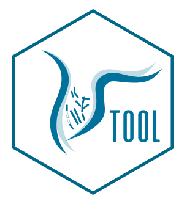
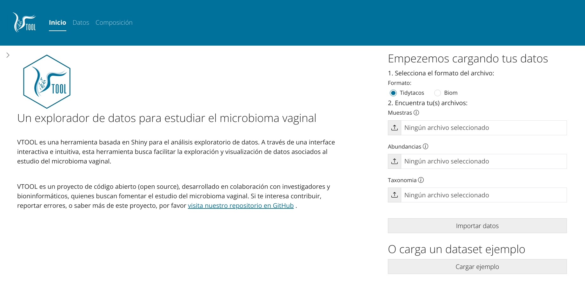
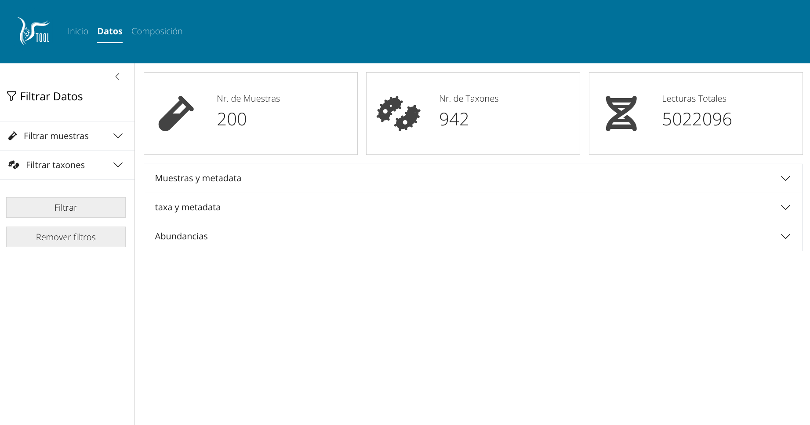
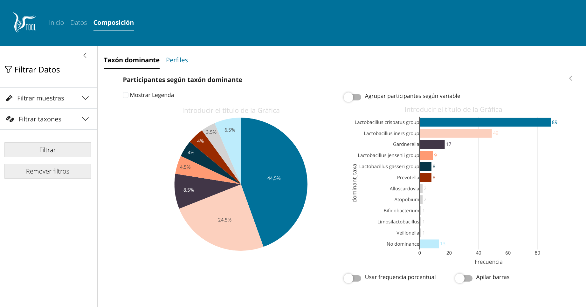
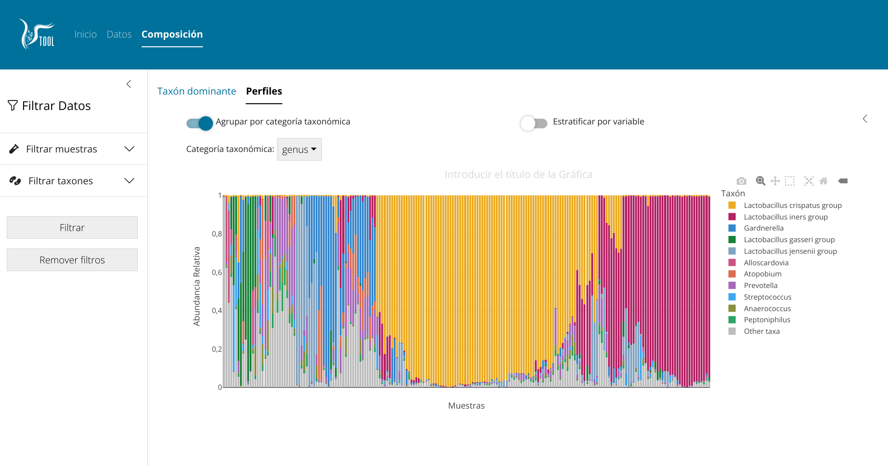

<!-- README.en.md is generated from README.Rmd. Please edit that file -->

```{r, include = FALSE}
knitr::opts_chunk$set(
  collapse = TRUE,
  comment = "#>",
  fig.path = "man/figures/README-",
  out.width = "100%"
)
```

# VTOOL

<!-- badges: start -->
[](https://github.com/jonatasemidio/multilanguage-readme-pattern/blob/master/README.md)
<!-- badges: end -->
<p align="center"></p>

VTOOL is a shiny application designed to explore microbial sequencing data with a focus on vaginal microbiota in relation to socio-demographic, clinical or lifestyle factors. 

VTOOL has been developed following a user-centered-design (UCD) approach.

The initial conceptual approach of VTOOL is as follows:









## Install

To install the development version of VTOOL in R, you can use the following command:

```
# install.packages("devtools") #un-comment if devtools not installed already
devtools::install_github("mticlla/VTOOL")
```

## Usage

Once installed, VTOOL can be accessed through a web application or run locally.

```
library(VTOOL)
VTOOL::run_app()
```
