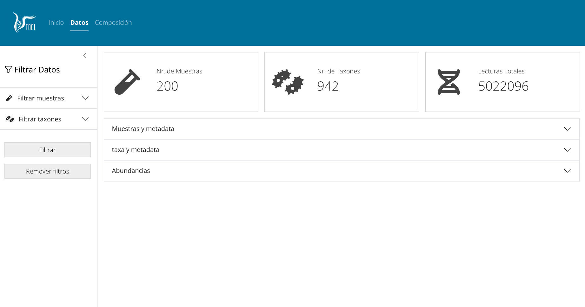
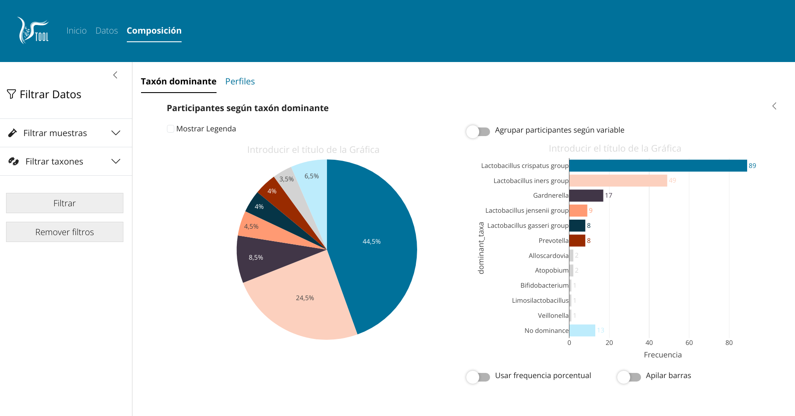
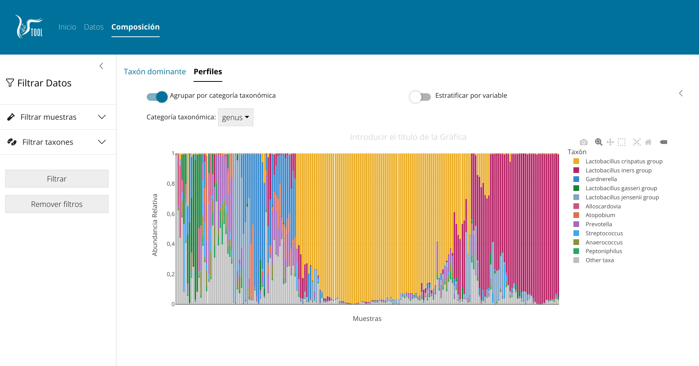

<!-- README.en.md is generated from README.Rmd. Please edit that file -->

# VTOOL

<!-- badges: start -->

<!-- badges: end -->

VTOOL is a shiny application designed to explore microbial sequencing
data with a focus on vaginal microbiota in relation to
socio-demographic, clinical or lifestyle factors.

VTOOL has been developed following a user-centered-design (UCD)
approach.

The initial conceptual approach of VTOOL is as follows:

## Install

To install the development version of VTOOL in R, you can use the
following command:

    # install.packages("devtools") #un-comment if devtools not installed already
    devtools::install_github("mticlla/VTOOL")

## Usage

Once installed, VTOOL can be accessed through a web application or run
locally.

    library(VTOOL)
    VTOOL::run_app()
